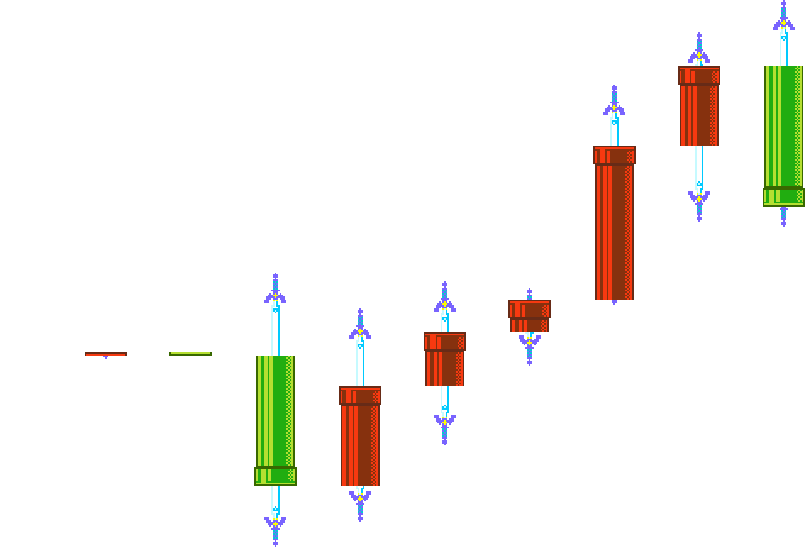

# SMM2 - Candlestick Chart Generator

## Introduction

创建一个可以基于分数生成K线图表的脚本

Create a python script that generates candlestick charts from multiplayer scores in SMM2 (Super Mario Maker 2).

**灵感来源于Bai水友社区**

**Inspired by the Bai fan community.**

本项目并不算完善的，还需要做很多事情，而且机制很可能后面会改不少，所以，有需求在issue提吧

This project isn't perfect yet—there's still a lot to do, and the mechanics are likely to change quite a bit. So, if you have any requests or suggestions, please drop them in the issues.

## Quick Start

Minimum Requirement: Install [Python](https://www.python.org/downloads/)

### Installation

*如果需要虚拟环境的话需要提前创建并激活*

*If a virtual environment is required, it needs to be created and activated in advance.*

```shell
pip install pillow pydantic
```

or

```shell
pip install -r requirements.txt
```

### Populate kline.csv

目前timestamp并没有被使用，只需要保证逻辑上是顺序即可，程序会自动对csv数据的timestamp字段做升序排序

Currently, the timestamp is not used; it only needs to be logically sequential. The program will automatically sort the timestamp field in the CSV data in ascending order.

```csv
timestamp,open,high,low,close
1718640000,7500,7622,7488,7583
1718553600,7583,7603,7491,7536
1718467200,7536,7572,7442,7445
1718380800,7445,7452,7406,7426
1718294400,7426,7456,7359,7394
1718208000,7394,7440,7314,7335
1718121600,7335,7461,7299,7412
1718035200,7412,7414,7412,7414
1717948800,7414,7414,7410,7412
1717862400,7412,7412,7412,7412
```

### Generate

在本目录所在路径执行(确保assets文件夹数据存在, kline.csv存在)

Run in the current directory path (ensure the 'assets' folder and 'kline.csv' are present).

```shell
python app.py
```

### Result

kline.png:


