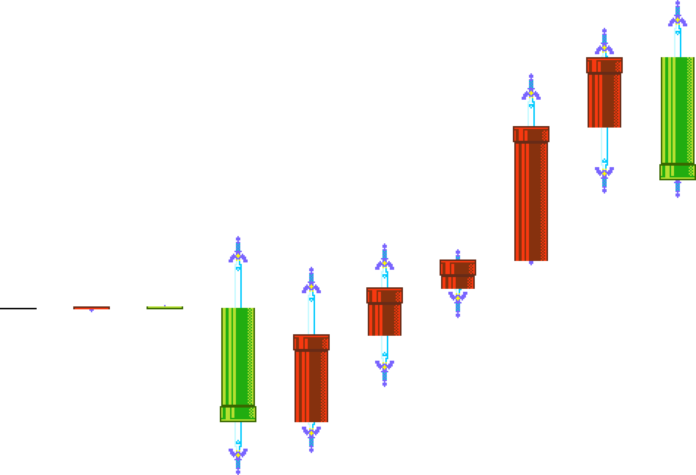

# SMM2 - Candlestick Chart Generator


## Introduction
创建一个可以基于分数生成K线图表的脚本

Create a python script that generates candlestick charts from multiplayer scores in SMM2 (Super Mario Maker 2).

*目前无完整的英文翻译，因为感觉不会有什么人用*

**灵感来源于Bai水友社区**

**Inspired by the Bai fan community.**

本项目并不算完善的，还需要做很多事情，而且机制很可能后面会改不少，所以，有需求在issue提吧

This project isn't perfect yet—there's still a lot to do, and the mechanics are likely to change quite a bit. So, if you have any requests or suggestions, please drop them in the issues.

## Quick Start
Minimum Requirement: Install [Python](https://www.python.org/downloads/)
### Installation
*如果需要虚拟环境的话需要提前创建并激活*

*If a virtual environment is required, it needs to be created and activated in advance.*

```shell
pip install pillow pydantic
```

or

```shell
pip install -r requirements.txt
```

### Populate kline.csv
目前timestamp并没有被使用，只需要保证逻辑上是顺序即可，程序会自动对csv数据的timestamp字段做升序排序

Currently, the timestamp is not used; it only needs to be logically sequential. The program will automatically sort the timestamp field in the CSV data in ascending order.

kline.csv:

```csv
timestamp,open,high,low,close
1718640000,7500,7622,7488,7583
1718553600,7583,7603,7491,7536
1718467200,7536,7572,7442,7445
1718380800,7445,7452,7406,7426
1718294400,7426,7456,7359,7394
1718208000,7394,7440,7314,7335
1718121600,7335,7461,7299,7412
...
```

### Generate
在本目录所在路径执行(确保assets文件夹数据存在, kline.csv存在)

Run in the current directory path (ensure the 'assets' folder and 'kline.csv' are present).

```shell
python app.py
```

### Result
kline.png:




## Image Properties
### 高度 / height
满足公式: `height = (candlestick.scale * (max(data.score) - min(data.score) + 1))`

简单说，记 assets 里面的 candlestick 配置的`scale`，那么每`scale`个像素对应一分

即如果给定的所有数据中，最高分是 $7800$，最低分 $7700$ 。那么图片的`height`就应该有 $101\text{scale}$，表示 $\left[7700,7800\right]$ 的闭区间

### 宽度 / width
这里的每个图像的宽也满足`scale`，`scale`乘上素材的宽度是每个素材可能的占用，一般的，会取所有素材的宽的最大值

而间隔`spacing`需要修改 assets 的 coordinate.json 配置

当前的`spacing`也会根据`scale`来放大，后面视情况独立。

### 顶部 / top
图片的最高位($y=0$)，被视为所有给定数据的最高分，本质所有的K线柱都是通过最高分算的

所以有利用需求可以通过**最高分位置**并且以**scale像分比例**去做如匹配坐标系等的应用

### 关于素材 / About assets
素材其实是可以替换的，请根据 assets 里面的图片与同名的 json 配置文件作为参考，更加细致的细节请参考 graphics/common.py

素材的组成部分是将素材文件**从上到下**计算长度（一般而言就是分数值）

- `static`会强制渲染出来，但为了维持像素与分数的对应关系，一般不会用，也不建议
- `region`表示素材文件的按量渲染部分（也就是不会重复的部分），比如大师剑渲染出被拔出多少的这样的效果
- `duplication`表示素材文件的依照给定长度堆叠渲染的部分，只要维持延伸纹理即可（非要不连贯也不是不可以）

在配置中的每个`static`、`region`、`duplication`数组都不能填入多个，只能填入一个数组，本来的打算是支持多部分，但是代码相对比较复杂，现在是简化版

而每个数组以四元组`(x, y, width, height)`的方式表示，这种格式在这里被称为 Coord Box。

该四元组支持整型和字符串表示：

- 整型`int`: 表示像素大小
- 字符串数字: 将转为整型
- `%`: 百分比将转换为素材文件的宽高比例（x对应`width`，y对应`height`）
- `px`: 与纯数值一致
- `center`: 表示素材对应的中位（`width // 2`，`height // 2`）
- `min`: 恒为 $0$
- `max`: 对应宽高的 $100\%$

**Example**

```json
{
    "region": [
        [0, 0, "100%", 24]
    ],
    "duplication": [
        [0, 24, "100%", 1]
    ]
}
```

表示对于长度在 $24$ 以内的，按长度选用`region`的图像，而长度大于 $24$ 的，则超过部分等量地堆叠`duplication`
